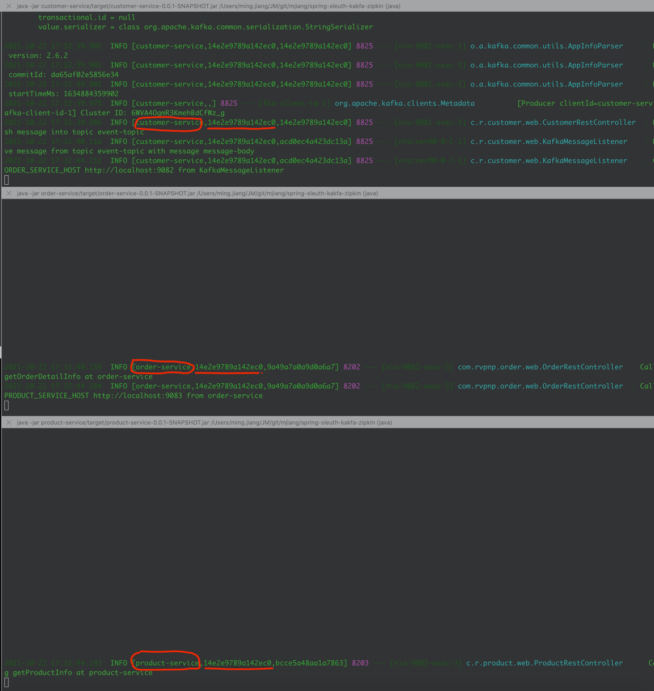
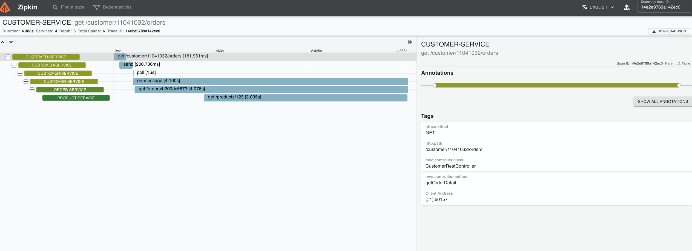
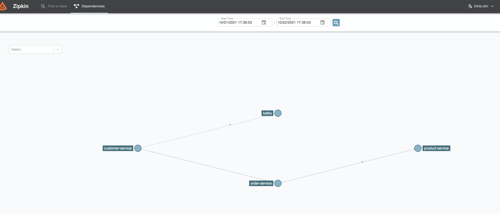

# Introduction

This project is to use SpringBoot, Spring Cloud Sleuth, Kafka and Zipkin to demonstrate how to
visualize distributed tracing across multiple microservices with Kafka.

# How to build

Build project by `mvn clean package`

# How to run

Go to `zipkin-server` module under folder `docker`, then run `docker compose up` this will start
Kafka server and Zipkin server

Kafka UI Admin: http://localhost:3030

Zipkin UI Admin: http://localhost:9411

# Start spring boot services from root folder

Start customer-service: `java -jar customer-service/target/customer-service-0.0.1-SNAPSHOT.jar`

Start order-service: `java -jar order-service/target/order-service-0.0.1-SNAPSHOT.jar`

Start product-service: `java -jar product-service/target/product-service-0.0.1-SNAPSHOT.jar`

# Invoke the endpoint

Using curl command to call endpoint `curl 'http://localhost:9081/customer/11041032/orders'` or just
put that url in the browser

# Find the traceId from log and search it in Zipkin Admin UI

### Terminal console

### Trace invocation screenshot

### Trace dependency screenshot

# Background
